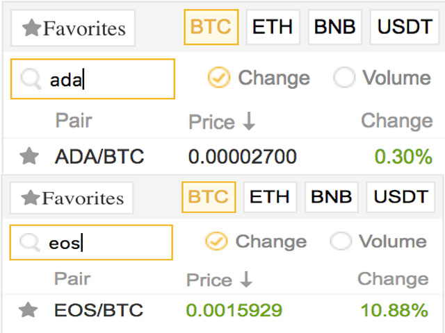
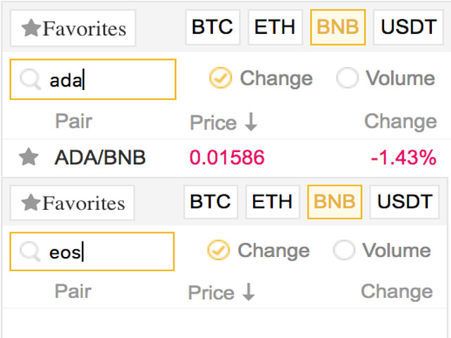
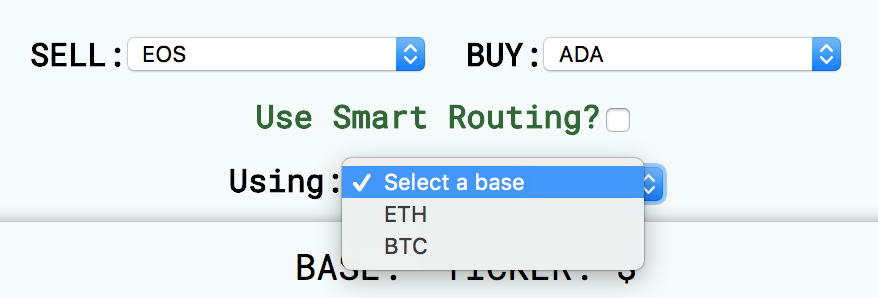
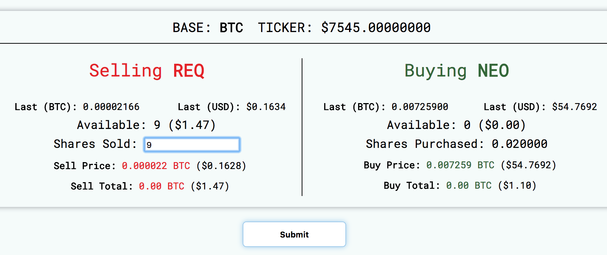

# Crypto Trade Router

## What is the crypto trade router?

Currently on exchanges you have to trade an **alt coin** against a **base coin.** For example, you can trade **TRX** against a base of **BTC,** or **ETH**.

### The Problem:

**What happens if you want to trade two alt coins against each other?**

For example: What if you're holding trade coin A, bad news comes out, and you want to buy coin B instead? This is a scenario that happens frequently for crypto day traders.

Currently you would have to:

1.  Find what `base coins` coin A trades against
2.  Find what `base coins` coin B trades against
3.  Find a match, choose one of them to use
4.  Sell coin A for a base coin manually
5.  Buy coin B for a base Coin

This process is **horribly inefficient** for a number of reasons!

1.  **Time:** Buy the time you find a connection, sell a coin, and buy the next one, the prices may have changed. Especially if news came out.
2.  **Efficiency:** What if there are many possible base coins? For example, **NEO** and **LTC** both trade against **BTC, ETH, BNB, and USDT.** Each one has different prices and amounts you can trade! How do you determine the best route?
    <figure>
      
      <figcaption>On Binance: Both ADA and EOS trade against BTC...</figcaption>
    </figure>
    <figure>
      
      <figcaption>But ADA trades against BNB, while EOS does not. 
        How do you quickly choose a base? Which is best?
      </figcaption>
    </figure>

### The Solution:

**Crypto Trade Router** attempts to solve these problems!

Crypto trade router:

1.  Allows you to select any alt coin
2.  Maps out any other alt coin it can be connected to
3.  If there are multiple baseCoins they can both trade against, uses **smartRouting** to choose the best route to trade (based on price and liquidity).

<figure>
  
  <figcaption>Using the trade router, you can choose from all base coins 
  Or select "smart routing" and let it choose the best one
  </figcaption>
</figure>

<figure>
  
  <figcaption>Makes relevant information accessible at a glance:
   Last price of both coins in USD and Base
   Purchase and sale information for coins in Base and USD
  </figcaption>
</figure>

<figure>
  
  <figcaption>Provides feedback on the routing and outcome
  </figcaption>
</figure>

It's designed to optimize for time and price on every crypto trade!

Currently the router is in BETA testing and integrated with **binance** accounts.

## How to Use:

**Disclaimer:** Router is still currently in open BETA testing, use at your own risk! Developer takes no responsibility for trading losses or any program issues.

1.  Clone the git repo locally
2.  Follow the instructions below to create the necessary local variables
3.  In terminal:

* `cd` into root, run `npm install`
* run `npm run start`

4.  Open a browser, navigate to localhost:4001
5.  Use the app

## Local Variable Configuration:

* Create a `.env` file in root
* Inside the file, define the following variables in the format `VAR=12345`:
  * `BINANCE_API_KEY`
  * `BINANCE_API_SECRET`
  * `PORT`
  * `SERVER_URL` - Base url client uses to make server requests
  * `CLIENT_SOCKET_ENDPOINT` - Server socket endpoint
  * Optional: `COINIGY_API_KEY`, `COINIGY_API_SECRET`

## Development:

Current Priorities:

* Refactor / clean code
* Add tests
* Test algorithms and predictions, further refine
* Create desktop app using electron

## Support:

I always welcome any help from contributors and program feedback!

Going from beta to a reliable trading product will still take a lot of work and time, and may never happen without funding.

If you find this product useful and want to help fund development, or just want to say thanks, you can send crypto to the below addresses:

* **BTC:** 122WesWDv4ugKtpdCB1sXfrK6oZW75YEFH
* **ETH:** 0xe5978176d0ba192d9b4f45b57493b0493f149fe3
